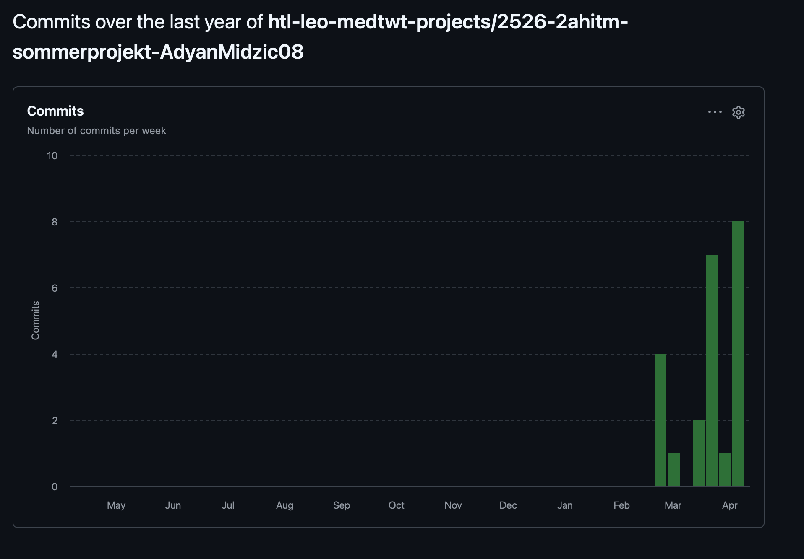
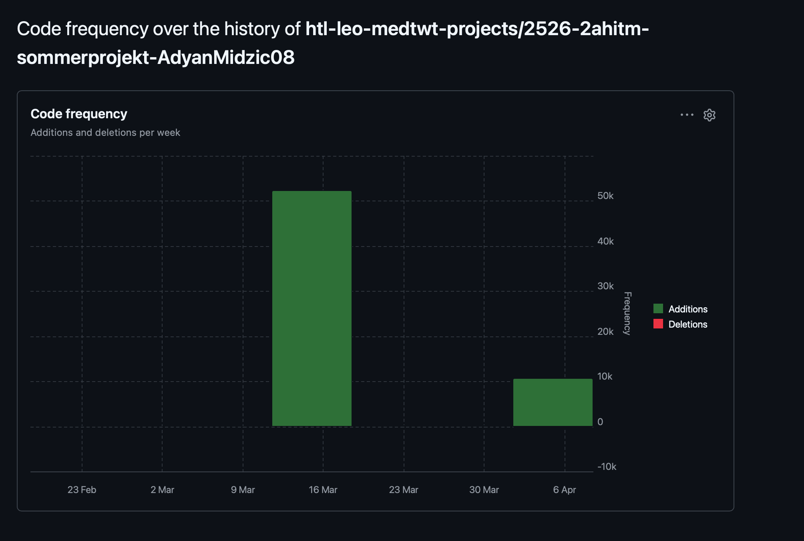

# Sprint 1 - UI

## Meine Ziele, die ich umgesetzt habe (UI)

1. Ich habe ein klares, modernes und benutzerfreundliches UI-Konzept erstellt.
2. Ich habe die Navigation strukturiert, damit wichtige Inhalte schnell und intuitiv erreichbar sind.
3. Ich habe ein konsistentes Designsystem mit einheitlichen Farben, Abständen und Typografie umgesetzt.
4. Ich habe die Oberfläche responsiv gestaltet, sodass sie auf Desktop und mobilen Geräten zuverlässig funktioniert.

## Meine Fortschritte in diesem Sprint

1. Das Grundlayout der zentralen Seiten wurde vollständig umgesetzt.
2. Wichtige UI-Komponenten wie Buttons, Karten und Eingabefelder wurden gestaltet und einheitlich integriert.
3. Erste visuelle Effekte und Animationen wurden eingebaut, um die Interaktion klarer und lebendiger zu machen.
4. Mehrere UI-Fehler wurden behoben, wodurch die Oberfläche stabiler und konsistenter geworden ist.

## Meine Ziele für den nächsten Sprint

1. Die restlichen Unterseiten im selben Stil fertigstellen.
2. Die Benutzerfreundlichkeit weiter verbessern, insbesondere durch klarere Rückmeldungen bei Interaktionen.
3. Das Spiel mit JavaScript schrittweise funktionsfähig machen und GSAP sinnvoll für Animationen sowie Übergänge integrieren.

## Sprint-Metriken

### Commits

### Code Frequency

