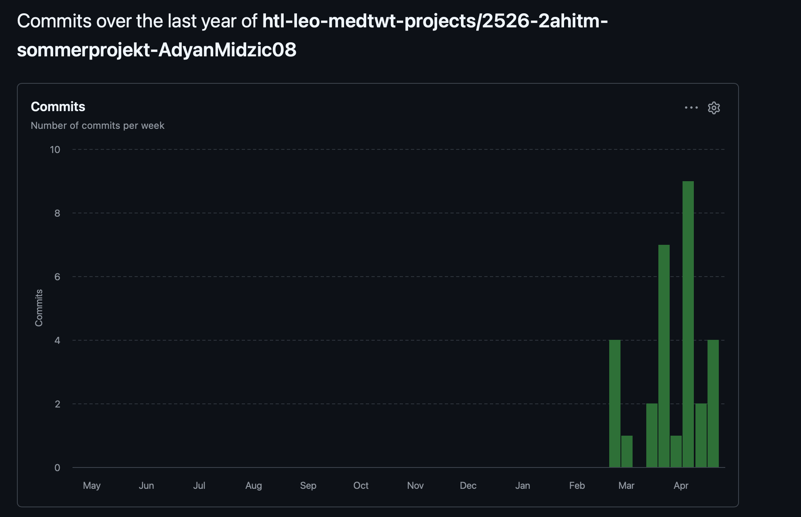
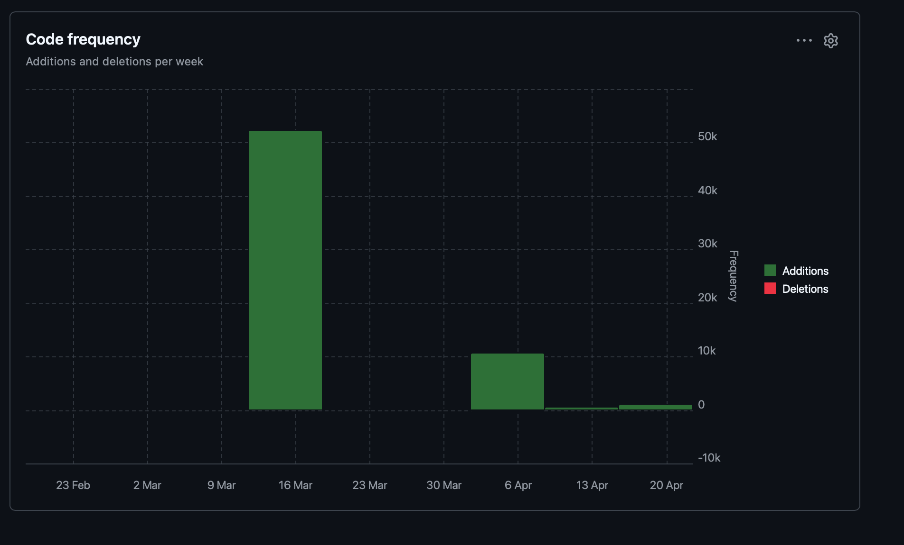

# Sprint 2 - Spielentwicklung

## Meine Ziele, die ich umgesetzt habe (Spiel)

1. Ich habe den Knowledge-Modus umgesetzt, sodass ein Quiz zu einem Thema vollständig durchgespielt werden kann.
2. Ich habe eine Auswertung am Ende der Runde umgesetzt, damit das Ergebnis nach dem Quiz klar sichtbar ist.
3. Ich habe Fragetypen im Quiz umgesetzt und getestet, darunter Multiple Choice als Basis.
4. Ich habe unterschiedliche Fragetypen ausprobiert, um die Quiz-Interaktion abwechslungsreicher zu gestalten.

## Meine Fortschritte in diesem Sprint

1. Der Ablauf im Knowledge-Modus funktioniert vom Start bis zum Ende einer Runde stabil.
2. Nach jeder beendeten Runde wird eine Auswertung mit den wichtigsten Ergebnissen angezeigt.
3. Multiple-Choice-Fragen wurden sauber eingebaut und in den Spielfluss integriert.
4. Weitere Fragetypen wurden getestet und technisch vorbereitet.

## Meine Ziele für den nächsten Sprint

1. Das Balancing der Punkte- und Coin-Belohnungen verbessern.
2. Die Rückmeldungen bei richtigen und falschen Antworten noch klarer und motivierender gestalten.
3. Dailys als spielbaren Modus einbauen und im Ablauf integrieren.
4. Achievements vielleicht einbauen, damit zusätzliche Ziele im Spiel möglich sind.

## Sprint-Metriken

### Commits

### Code Frequency

