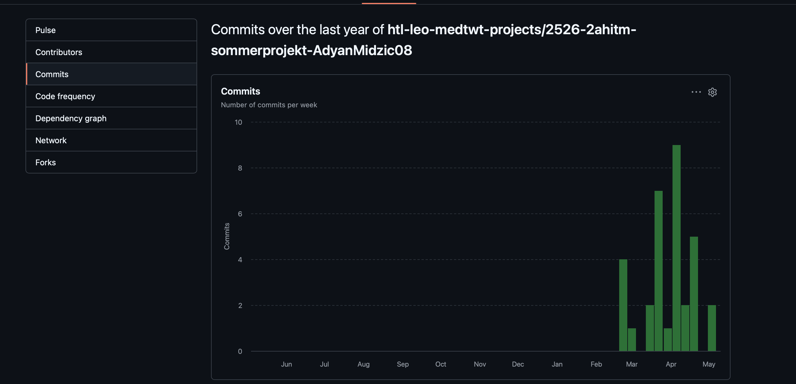
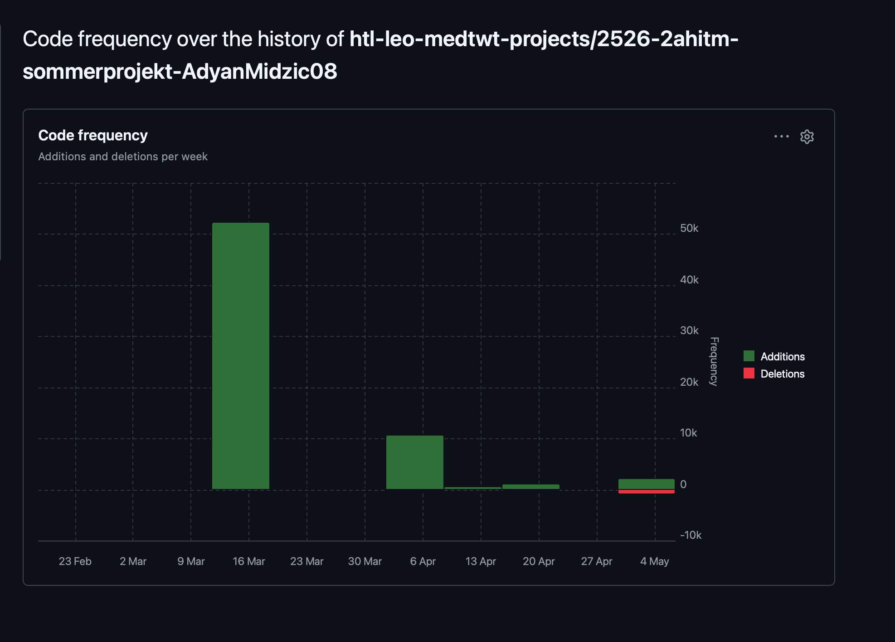

# Sprint 3 - Achievements & Dailys System

## Meine Ziele, die ich umgesetzt habe (Spiel)

1. Ich habe ein vollständiges Achievement-System mit 6 verschiedenen Achievements implementiert, die automatisch freischalten wenn bestimmte Ziele erreicht werden.
2. Ich habe ein Dailys-System eingebaut, mit dem der Spieler täglich neue Quiz-Fragen bekommt und durch Streaks Boni verdient.
3. Ich habe die Profile-Seite optimiert, sodass alle Stats dynamisch vom localStorage angezeigt werden und sich in Echtzeit aktualisieren.
4. Ich habe localStorage-Persistierung für das komplette Achievement- und Dailys-System implementiert.

## Meine Fortschritte in diesem Sprint

1. Die Achievement-Freischaltung funktioniert zuverlässig und aktualisiert sich automatisch nach jedem Quiz im Knowledge- und Daily-Modus.
2. Das Dailys-System zeigt jeden Tag eine neue Frage an, basierend auf dem aktuellen Datum, mit automatischem Streak-Tracking und Belohnungen.
3. Die Profile-Seite zeigt alle Spieler-Statistiken korrekt an mit dynamischem Aktualisieren bei neuen Coins und Punkten.
4. Der Code wurde ohne ES6-Shorthand geschrieben und ist strukturiert mit separaten Dateien für Daten und Logik.

## Meine Ziele für den nächsten Sprint

1. Ein Audio- und Sound-Design-System einbauen mit Background-Musik und Sound-Effekten für verschiedene Spielereignisse.
2. Das CSS und UI-Design der Achievements, Daily-Quizze und Profile-Seite verbessern mit neuen Hover-Effekten und Animationen.
3. Ein Shop-System implementieren, in dem der Spieler mit Coins verschiedene Items oder Skins kaufen kann.
4. Die Responsiveness und das Mobile-Design der gesamten Anwendung überprüfen und optimieren.

## Sprint-Metriken

### Commits

### Code Frequency

