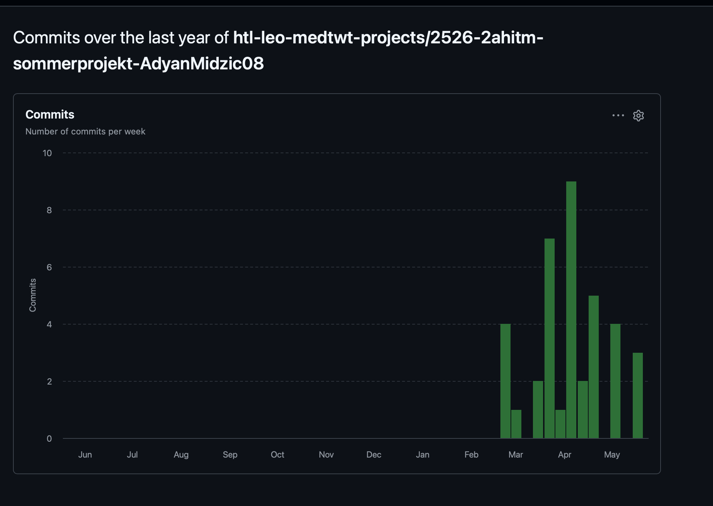
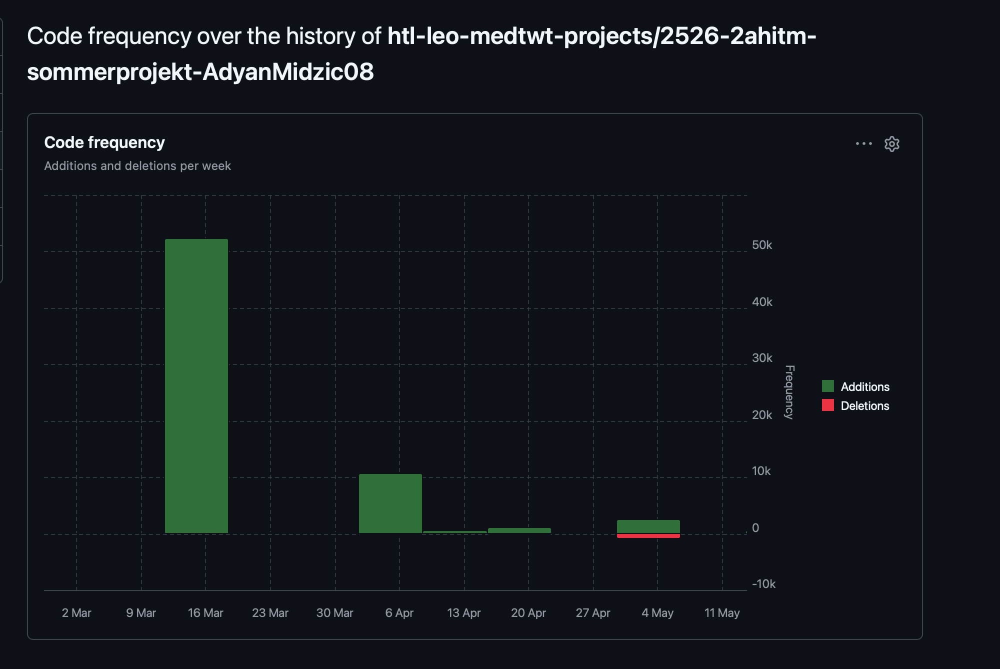

# Sprint 4 - Audio System, Shop System & Quiz Design

## Meine Ziele, die ich umgesetzt habe (Spiel)

1. Ich habe ein vollständiges Audio-System mit Sound-Effekten für verschiedene Spielereignisse implementiert.
2. Ich habe ein Shop-System eingebaut, in dem der Spieler mit Coins verschiedene Items kaufen kann.
3. Ich habe das Design und die visuelle Ausgabe des Quiz-Outputs überarbeitet und verbessert.
4. Alle neuen Features wurden mit localStorage-Persistierung integriert.

## Meine Fortschritte in diesem Sprint

1. Das Audio-System funktioniert zuverlässig mit Loading Screen Musik und Sound-Effekten für verschiedene Aktionen (richtige Antwort, falsche Antwort, Achievement freischalten, etc.).
2. Das Shop-System ermöglicht es dem Spieler, mit gesammelten Coins verschiedene Items zu kaufen und sein Spielerlebnis zu personalisieren.
3. Das Quiz-Output-Design wurde komplett überarbeitet mit besseren visuellen Effekten, klarerem Layout und verbesserten Animationen für Antworten.
4. Der Code wurde modular strukturiert mit separaten Dateien für Audio-, Shop- und Quiz-Logik.

## Meine Ziele für den nächsten Sprint

1. Die Responsiveness und das Mobile-Design der gesamten Anwendung überprüfen und optimieren.
2. Weitere visuelle Effekte und Animationen hinzufügen, um das User Experience zu verbessern.
3. Performance-Optimierungen durchführen und den Code refaktorieren.
4. Testing und Bug-Fixes für alle Features durchführen.

## Sprint-Metriken

### Commits

### Code Frequency

