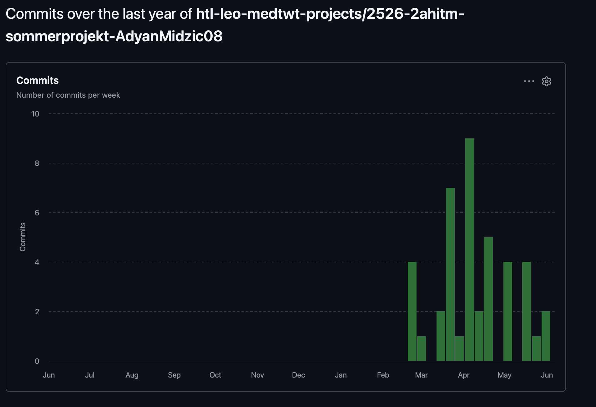
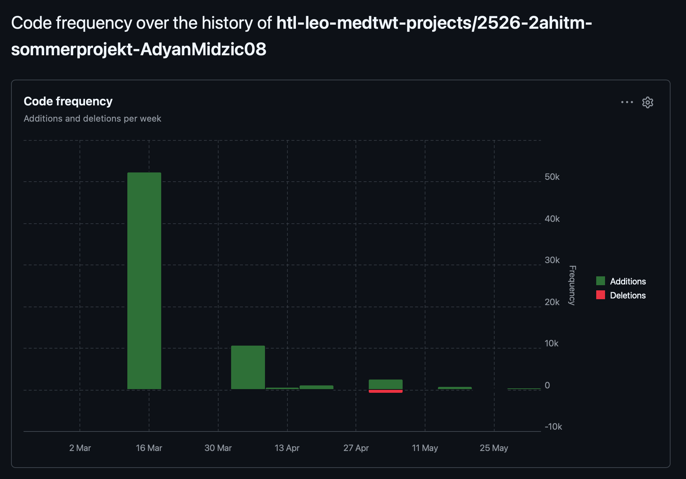

# Sprint 5 - Audio System Fixes, UX Redesign & System Optimization

## Meine Ziele, die ich umgesetzt habe (Spiel)

1. Ich habe das Audio-System vollständig überarbeitet und alle bestehenden Fehler behoben.
2. Ich habe das Hintergrundmusik-System vollständig integriert und optimiert für ein nahtloses Spielerlebnis.
3. Ich habe die gesamte User Experience (UX) neu gestaltet und überarbeitet für bessere Benutzerfreundlichkeit.
4. Ich habe das System stabilisiert und auf Performance optimiert für den nächsten Sprint.

## Meine Fortschritte in diesem Sprint

1. Das Audio-System wurde vollständig debuggt und getestet - alle Sound-Effekte funktionieren zuverlässig ohne Latenzen oder Ausfälle.
2. Die Hintergrundmusik wurde nahtlos in den Spielablauf integriert mit automatischem Abspielen beim Start und korrektem Volumen-Management.
3. Die gesamte UX wurde neu designed - verbesserte Navigation, klarerem Layout, besseren Übergangseffekten zwischen Screens und intuitiverer Bedienung.
4. Der Code wurde optimiert, unnötige Dependencies wurden entfernt und die Dateistruktur wurde für bessere Wartbarkeit reorganisiert.

## Meine Ziele für den nächsten Sprint

1. Weitere visuellen Effekte und Animationen hinzufügen (Particle Effects, Transitions, Hover-States).
2. Sound-Effekte für alle Interaktionen und Übergänge verstärken und erweitern.
3. Visual Feedback für Benutzeraktionen verbessern (Loading States, Success/Error Animations).
4. Testing und letzte Bug-Fixes vor dem finalen Release durchführen.

## Sprint-Metriken

### Commits

### Code Frequency

